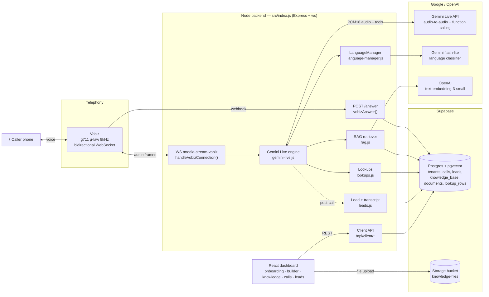
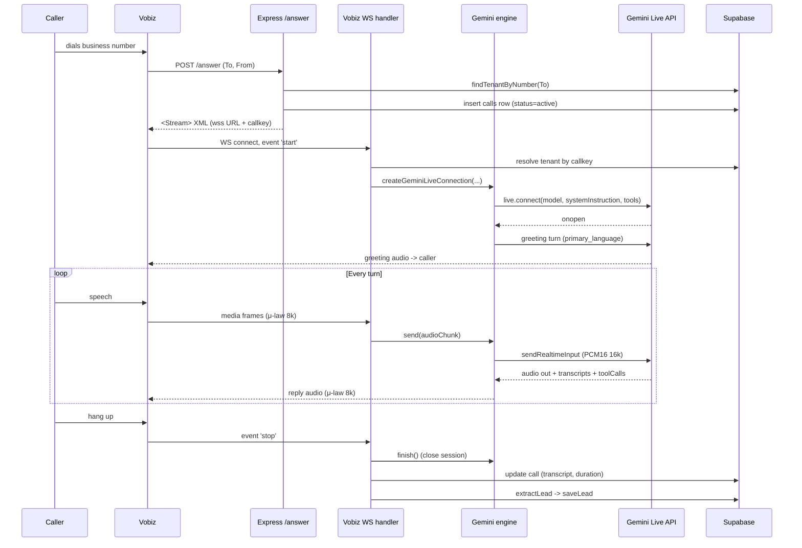
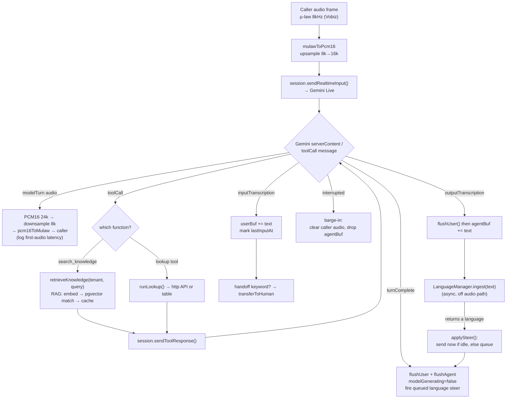
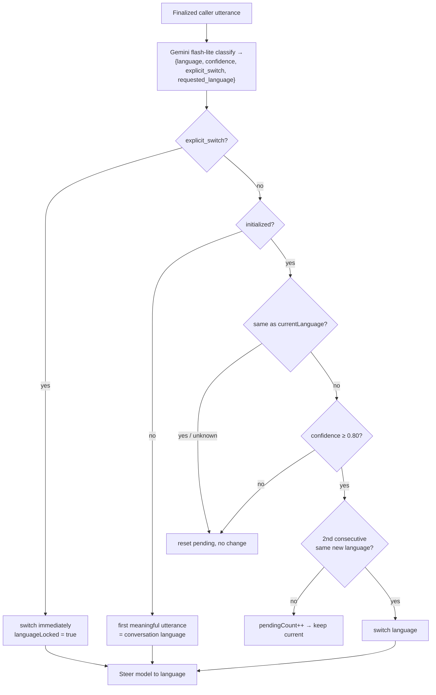
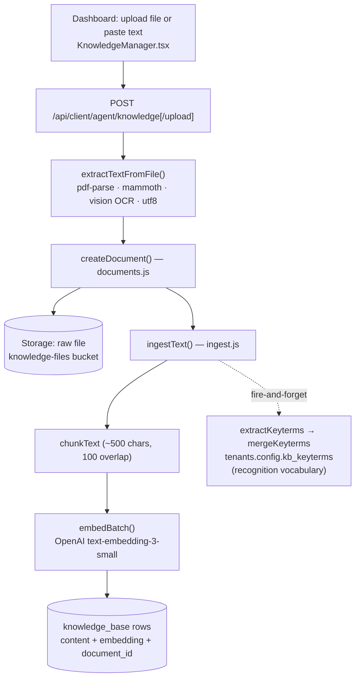
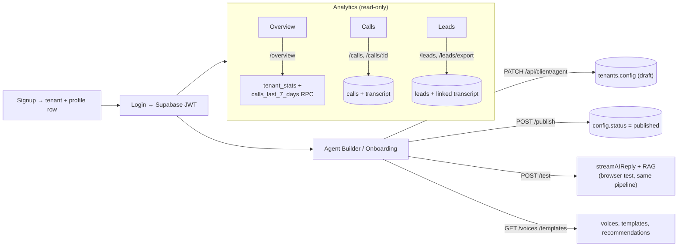
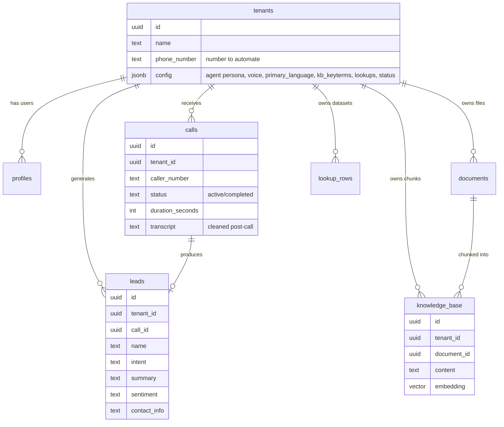

# Voice Agent — End-to-End Architecture

Multi-tenant multilingual voice agent SaaS. Telephony via **Vobiz**, speech-to-speech
via **Google Gemini Live**, RAG + lookups on **Supabase (Postgres + pgvector)**, and a
**React dashboard** for onboarding, knowledge, calls, and leads.

The active voice engine is chosen by `VOICE_ENGINE`:
- `gemini` (current) → `src/services/gemini-live.js` (Gemini Live, audio-to-audio)
- `realtime` → `src/services/realtime.js` (OpenAI gpt-realtime)
- `pipeline` → `src/services/deepgram.js` (legacy STT→LLM→TTS, rollback)

All three share one interface: `create…Connection(callSid, tenantConfig, sink, streamId, onTranscript, onReady, callerNumber) → { send, finish }`.

---

## 1. System architecture (how everything is wired)

---

## 2. Call lifecycle — pickup to hang-up

---

## 3. Per-turn conversation loop (the core engine)

This is what runs inside `gemini-live.js` on every Gemini message.

Key safety details:
- **Steering never injected mid-reply** — queued and fired only at `turnComplete` (else the session deadlocks and the call goes silent).
- **First-audio latency** logged as `⏱️ first audio Xms after you stopped speaking`.
- **Reconnect guard** — only reconnects on a genuine mid-call drop (`gotMessage` true), never on an instant setup rejection.

---

## 4. Language decision (LanguageManager state machine)

Why: callers code-mix ("Mujhe **Kokapet** mein **flat** chahiye" = Hindi). A regex flips
language on every English noun; the classifier reports the **matrix** language, and
hysteresis (2 confident signals) prevents oscillation. Explicit requests bypass hysteresis.

---

## 5. Knowledge ingestion (dashboard → RAG)

Deleting a document cascades to its `knowledge_base` chunks and removes the Storage file.

---

## 6. Dashboard flows (config + analytics)

---

## 7. Data model

---

## 8. Post-call processing (zero added live latency)

On `stop` / WS close, `finalize()` runs:
1. Build raw transcript from buffered Agent/Caller turns.
2. `cleanTranscript()` — gpt-4o-mini rewrites garbled caller STT into a readable conversation.
3. Update the `calls` row (status, transcript, duration).
4. `extractLead()` — gpt-4o-mini extracts structured lead JSON → `saveLead()` into `leads`.
5. `clearHistory(callSid)` — free in-memory conversation state.
